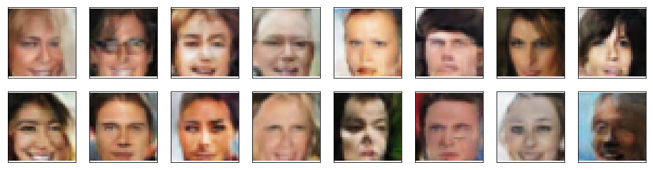
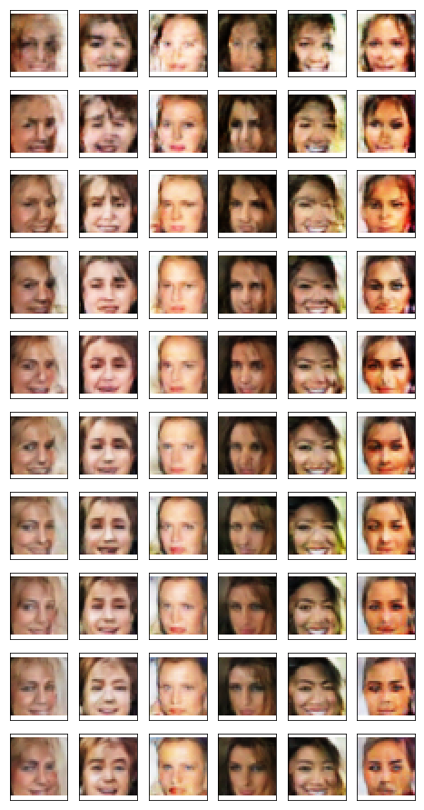

# Deep Learning - GAN - Generate Faces

This is DCGAN implementation of a face generation algorithm, which takes in a large number of face images and generates a new face image made from scratch
from a **latent vector z (random uniform distribution in [0,1])**. 

Below are some samples of newly generated faces:

There are 2 main components of this model:

1. **Discriminator**: 4-Layer CNN - Given a face image, distinguishes it as a real or a fake (generated) image

2. **Generator**: 4-Layer CNN - Given a latent vector z, generates a new face image from learned weights from images in training set. It tries to trick the 
Dircriminator to think that the generated image is REAL. 

## Repository 

This repository contains:
* **dlnd_face_generation.ipynb** : Complete code for pre-processing and batching data, building DCGAN, training DCGAN, and visualizing the generated faces
					  
## Datasets

Datasets necessary for this implementation can be downloaded by clicking [here](https://s3.amazonaws.com/video.udacity-data.com/topher/2018/November/5be7eb6f_processed-celeba-small/processed-celeba-small.zip).

## List of Hyperparameters used:

* Batch Size = **128**
* Generated Image Size = **32 x 32**  
* Model = **4 * 4 * 128 GAN Model**  
* Epoch = **30**  

* Eength of latent vector z = **100**  
* Weight Initialization = **Zero-centered Normal distribution with std 0.02**  

* Loss Function = **BCEWithLogitsLoss**  
* Optimizer  = **Adam**  
* Initial Learning Rate, [beta1, beta2] = **0.0002, [0.5, 0.999]**  

Below are some samples of newly generated faces progress by epoch:

